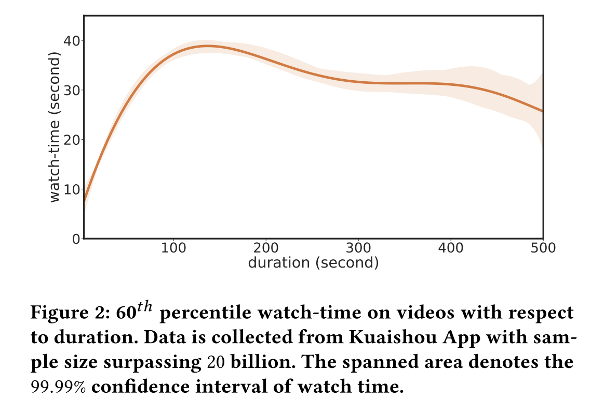
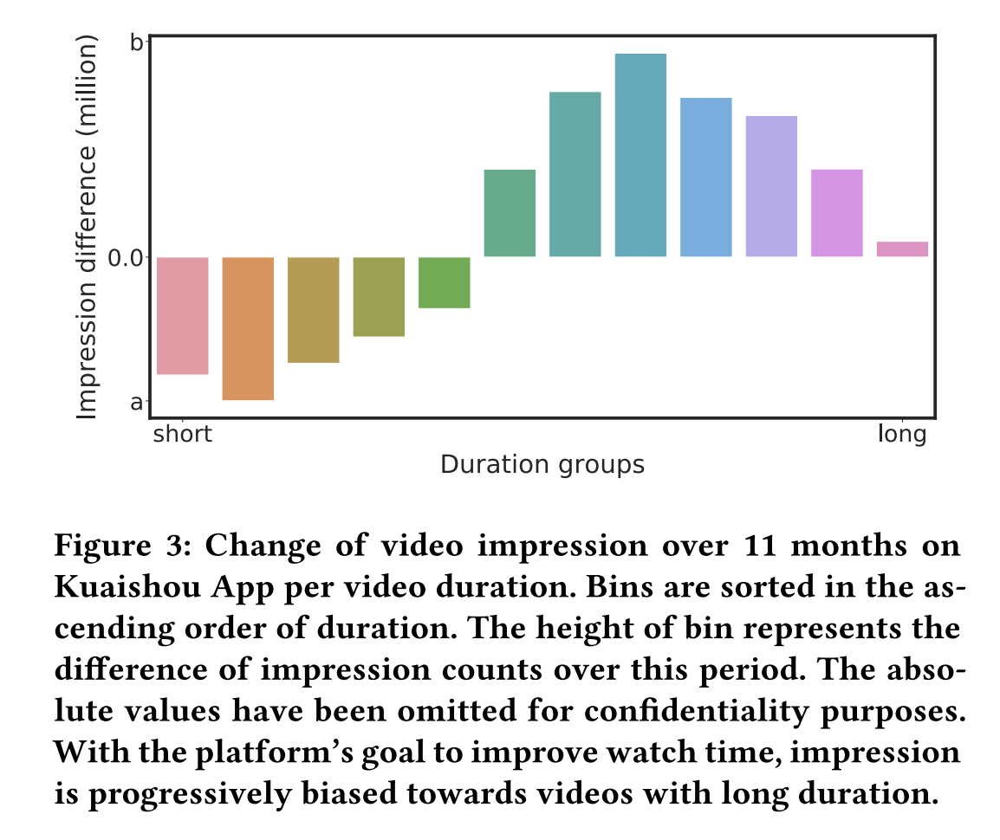

# Deconfounding Duration Bias in Watch-time Prediction for Video Recommendation

KDD 2022 HKUST & Kuaishou

## Motivation
时长预测不只取决于用户和视频之间的match程度，它经常被视频本身的时长（duration）误导：以提高用户时长为目标，模型倾向于推荐时长较长的视频，再使用有偏的数据上训练会进一步放大偏差，误导平台过度推荐长视频，低估了潜在的用户兴趣。

Watch time 受两个因素影响：1. 用户对视频的感兴趣程度； 2. 视频本身的时长

## Contribution

## Method

## Experiments

## Conclusion

